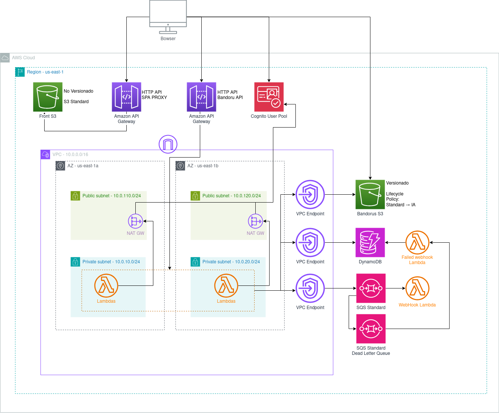

# Bandoru - A code Sharing platform
## Grupo 9 - Integrantes
- Federico Shih
- Franco David Rupnik
- Agustín Morantes
- Matías Manzur

## What and why
Bandoru is a full-stack application that leverages S3 and cloud technologies to share code securely and update code configurations on the fly. It was created for a graduate course in Cloud Computing using AWS and created prioritizing Scalability, Elasticity and Decoupled Architecture. 
### Features
- Upload Bandoru. Upload multiple files of huge sizes concurrently. Detects syntax from file extension.
- Anonymous, private and public sharing. Private checks that its the Bandoru's owner before retrieving the Bandoru.
- Push changes, basically rewrites the Bandoru. Done for private and public sharing.
- Bookmark Bandorus, to not lose critical shared bandorus.
- Fork Bandorus, to create your own copy of existing shared Bandorus.
- Add Webhooks, that notify the specific webhook when there are new updates of your Bandoru. Sends a JSON to the webhook and populates the "content" property for a fast demo with discord.
- List the bandorus you created.

## Architecture - Arquitectura


### Decisions
- Due to restrictions using AWS Academy, to provide HTTPS to the frontend application we are using a Amazon API Gateway that provides HTTPS. This is normally done using Cloudfront. DO NOT do this.
- Use Cognito User Pool to manage clients and validate the Bearer token.
- Use AWS Lambdas with Python 3.12 for the core backend of the application.
- Hosted an Angular SPA in AWS S3. Used Tailwind CSS and DaisyUI to quickly generate a theme. It's ✨darkmode✨.
- Saving Bandoru files in S3 bucket connected by VPC Endpoint. In the future to prioritize security this should use encryption at rest and in transit.
- Use DynamoDB for low cost and blazing-fast write speeds. Could consider using RDS with an RDS Proxy for lambda connections if the model gets way out of hand.
- Use SQS for notified webhooks. Has a redrive-policy of 3 retries, and then it is sent to a Dead letter Queue where its registered into DynamoDB.
- Use Terraform with AWS Provider for fast deployment and migration of architecture. This configures the architecture with one command. Currently, it is creating 105 resources. This is due to us creating 13 Lambdas, 10 with API Gateway integration, a VPC, multiple endpoints.

## How to Deploy - EN

### Prerequisites
- Docker

### Steps
1. Place the AWS credentials in `~/.aws/credentials`. The `default` profile will be used.
2. Ensure the Docker daemon is running:
   ```bash
   sudo systemctl start docker
3. Ensure the user is in the `docker` group:
```shell
sudo groupadd docker
sudo usermod -aG docker $USER
newgrp docker
# Verify that Docker can be run without sudo:
docker run hello-world
# If it still doesn’t work, restart the computer to apply the changes.
```
4. Execute deploy script `./docker-deploy.sh` -> it takes a long time.
5. Wait for terraform mutation, frontend and backend deploy. In the end, it will print out the website URL.

Terraform variables are located in /terraform/terraform.tfvars, where you can set the AWS profile to use. By default, it uses the default profile.

Note: We once encountered an issue where the AWS credentials expired midway through terraform apply, resulting in an error indicating that the account lacks permissions to make a specific modification. If this happens, restart the lab, reset the credentials, and rerun the script.

---

## How to deploy - ES
### Prerequisitos
- docker

### Pasos
1. Colocar las credenciales de aws en `~/.aws/credentials`. Se usara el perfil `default`.
2. Asegurarse que el docker daemon se está ejecutando (`sudo systemctl start docker`)
3. Asegurarse que el usuario se encuentra en el grupo `docker`:
```shell
sudo groupadd docker
sudo usermod -aG docker $USER
newgrp docker
# Verificar que se puede ejecutar docker sin sudo:
docker run hello-world
# Si no se puede aún, reiniciar la pc para aplicar los cambios
```
4. Ejecutar el script de deploy `./docker-deploy.sh` -> Puede tardar varios minutos. :)
5. Esperar a que se ejecute el terraform y el deploy del frontend y el backend. Al final de todo, imprimirá la URL del sitio web.

Las variables de terraform están en `/terraform/terraform.tfvars`. Ahí se puede establecer cuál es el profile de aws a usar. Por defecto usa el 'default'.

**Nota:** Una vez sola nos pasó que se vencieron las credenciales de aws a la mitad del terraform apply y tiro un error que la account no tiene los permisos para hacer X modificación. Si esto sucede, apagar y prender el lab, volver a setear las credenciales y ejecutar de nuevo el script.

## Módulos utilizados
Los módulos externos que se usan en el código son los siguientes:
- ["terraform-aws-modules/dynamodb-table/aws"](https://registry.terraform.io/modules/terraform-aws-modules/dynamodb-table/aws/latest): Módulo para crear tablas de DynamoDB e indices.
- ["terraform-aws-modules/vpc/aws"](https://registry.terraform.io/modules/terraform-aws-modules/vpc/aws/latest): Módulo para crear VPCs y todo lo necesario dentor de las mismas.

Los módulos internos que se usan en el código son los siguientes:
- [lambda](lambda): Módulo para crear las lambdas para cada funcion que se implementa en el backend incluido los API Gateway y los permisos necesarios.

## Uso de funciones y meta-argumentos
Las funciones usadas en el código son las siguientes:
- [abspath](https://developer.hashicorp.com/terraform/language/functions/abspath): Devuelve la ruta absoluta de un archivo, lo usamos para obtener el path del root y con ello poder acceder al archivo de codigo placeholder de Lambdas.
- [zipmap](https://developer.hashicorp.com/terraform/language/functions/zipmap): Construye un mapa en base a dos listas ([keys],[values]), lo usamos para construir el mapa de variables de entorno de las Lambdas.
- [length](https://developer.hashicorp.com/terraform/language/functions/length): Devuelve la longitud de una lista, lo usamos para obtener la cantidad de elementos en el modulo de lambda y saber cuantas tenemos que crear.
- [join](https://developer.hashicorp.com/terraform/language/functions/join): Permite concatenar strings, lo usamos para armar el source_arn que se usa en el permiso de la lambda.

Los meta-argumentos usados en el código son los siguientes:
- [count](https://developer.hashicorp.com/terraform/language/meta-arguments/count): Permite crear múltiples recursos de un mismo tipo, lo usamos para crear múltiples lambdas que sólo cambian en el nombre.
- [for_each](https://developer.hashicorp.com/terraform/language/meta-arguments/for_each): Permite crear múltiples recursos de un mismo tipo, lo usamos para crear varios de los recursos necesarios.
- [depends_on](https://developer.hashicorp.com/terraform/language/meta-arguments/depends_on): Permite establecer dependencias entre recursos, lo usamos para explicitar varias de las dependencias que tienen los recursos que no pueden ser inferidas como en los buckets.

